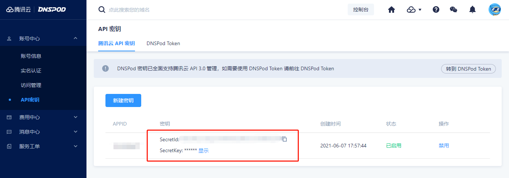
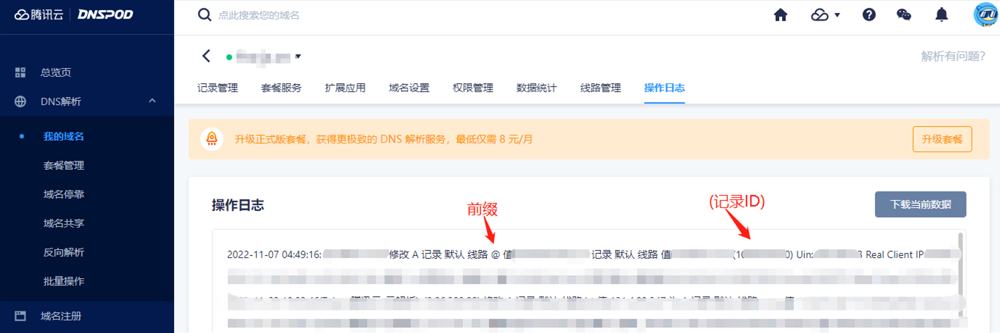

# 动态域名IP解析腾讯云专版

### 说明

获取家用宽带动态公网ip，实时同步到腾讯云进行解析

### API秘钥
- 访问如下地址获取API秘钥
> https://console.dnspod.cn/account/token/apikey



### 记录ID

- 前往获取你的记录ID，记得把域名改成你自己的
> https://console.dnspod.cn/dns/你的域名/log
> 
> 

### 编译运行
```shell
# 启用 go mod
go env -w GO111MODULE=on
#使用七牛云代理
go env -w GOPROXY=https://goproxy.cn,direct

# go mod init ddns
go mod tidy

# 编译
go build -o ddns main.go

# 后台运行
nohup ./dddns &
```